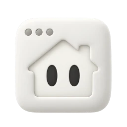

# CARBON’s AI testing team

Jay orchestrates CARBON’s specialist sub-agents. These are AI testing perspectives, not human reviewers. A profile describes available expertise; only recorded execution evidence establishes what was tested.

## Jay — AI Test Manager

Modeled on Jason Arbon’s approach to testing: start with the customer’s intent, follow the consequential risks, challenge the evidence, and make the next useful action clear.

## Security sub-agent

Web-application security specialist focused on authentication, authorization, session safety, exposed data, dependencies, and practical vulnerability evidence.

- security
- authentication
- authorization
- sessions
- secrets

## OWASP sub-agent

OWASP-focused security specialist who challenges access control, injection, insecure design, misconfiguration, vulnerable components, integrity, logging, and SSRF risks.

- security
- owasp
- networking
- api

## Accessibility sub-agent

Accessibility specialist focused on keyboard use, assistive technology, inclusive interactions, responsive access, labels, feedback, and barriers affecting disabled users.

- accessibility
- a11y
- keyboard
- assistive-technology

## WCAG sub-agent

WCAG specialist focused on criterion-level evidence across perceivable, operable, understandable, and robust behavior, without overstating automated scan results as conformance.

- accessibility
- a11y
- wcag
- conformance

## Usability sub-agent

User-centered design and usability specialist focused on discoverability, task clarity, responsive behavior, interaction friction, visual hierarchy, and inclusive UX.

- usability
- ux
- ui
- compatibility
- localization

## Compatibility sub-agent

Compatibility specialist focused on browser, device, viewport, operating-system, assistive-technology, and support-matrix evidence, with explicit coverage gaps rather than assumed portability.

- compatibility
- cross-browser
- responsive
- devices
- assistive-technology

## Performance sub-agent

Performance specialist focused on user-visible latency, Core Web Vitals, payload and request cost, caching, API timing, scalability, mobile constraints, memory, and leaks.

- performance
- perf
- web-vitals
- networking
- reliability

## Content sub-agent

Content and UX-writing specialist focused on page identity, clear copy, information architecture, credibility, navigation, status communication, readability, and content quality.

- content
- copy
- spelling
- seo
- ui

## Localization sub-agent

Localization specialist focused on translation accuracy, locale formats, pluralization, truncation, bidirectional layout, cultural fit, regulatory copy, and recovery behavior across languages.

- localization
- i18n
- l10n
- rtl
- content

## Data integrity sub-agent

Data-integrity specialist focused on agreement between rendered values, APIs, events, schemas, exports, storage, calculations, retention, and downstream state.

- data
- data-integrity
- api
- events
- schemas

## Forms sub-agent

Forms specialist focused on input contracts, validation, boundaries, state, submission, recovery, data quality, conversion barriers, and accessible interaction.

- forms
- form
- functionality
- data

## Error UX sub-agent

Error and recovery specialist focused on truthful status, clear messages, consistent severity, actionable recovery, safe logs, failure loops, and user trust.

- error-ux
- errors
- ux
- functionality
- reliability

## Search sub-agent

Search-interface specialist focused on discoverability, query handling, suggestions, empty states, input accessibility, relevance feedback, and resilient result navigation.

- search
- functionality

## News & content sub-agent

Digital publishing specialist focused on article identity, readability, supporting media, metadata, context, advertising boundaries, and multi-device content behavior.

- publishing
- news
- content

## Landing pages sub-agent

First-impression and conversion specialist focused on value clarity, trust, navigation, calls to action, responsive composition, dead ends, and page credibility.

- landing-page
- landing
- ui
- ux

## Checkout sub-agent

Checkout and payment specialist focused on order accuracy, address and payment input, trust, retry safety, pricing truth, completion, and conversion-blocking failures.

- checkout
- ecommerce
- payment
- functionality

## Shopping cart sub-agent

Shopping-cart specialist focused on line-item state, quantities, promotions, totals, inventory changes, persistence, accessibility, and safe transition to checkout.

- cart
- shopping-cart
- ecommerce
- functionality

## Pricing sub-agent

Pricing and subscription specialist focused on plan clarity, comparison, currency and locale, hidden conditions, billing cadence, conversion paths, and truthful claims.

- pricing
- localization

## Privacy sub-agent

Privacy specialist focused on personal-data exposure, consent, tracking, collection minimization, storage and transfer, debug leakage, user expectations, and AI-specific privacy risks.

- privacy
- pii
- ccpa
- data

## GDPR sub-agent

GDPR specialist focused on lawful consent, personal-data exposure, international transfer, minimization, retention, security, data-subject rights, transparency, and accountability.

- privacy
- gdpr
- data
- compliance

## Cookie consent sub-agent

Cookie-consent specialist focused on prior consent, purpose and vendor choices, reject symmetry, preference persistence, withdrawal, tracking verification, and regional behavior.

- privacy
- cookie-consent
- cookies

## Legal policy sub-agent

Policy-content specialist focused on discoverability, internal consistency, versioning, contact details, user rights, actual-product alignment, accessibility, and credible presentation.

- privacy
- legal
- policy

## AI-generated code sub-agent

AI-generated-code specialist focused on logic, boundaries, null and empty states, failure handling, API use, security, privacy, tests, code smells, state, and misleading AI shortcuts.

- ai-code
- vibe-coding
- code-review
- functionality
- data
- api

## AI chatbot sub-agent

Conversational-AI specialist focused on task success, conversation quality, state, memory, recovery, privacy, safety, injection, tools, latency, integration, and nondeterminism.

- ai-chatbot
- chatbot
- functionality
- api
